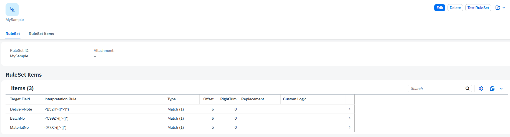
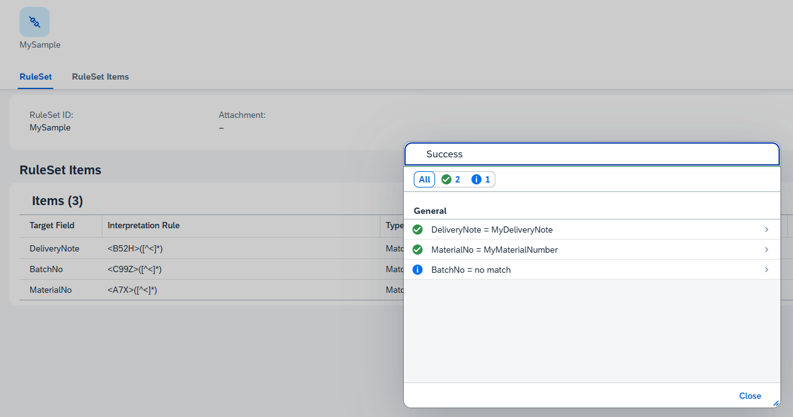

# ZASIS — ABAP String Interpreter

[](https://github.com/MagPasulke/abap-string-interpreter/actions/workflows/ci.yml)

> **⚠️ Pre-release:** Until v1.0.0 is reached, breaking changes may occur without prior notice.

ZASIS extracts structured data from unstructured strings. You configure regex-based RuleSets, pass in a raw string (e.g. a barcode scan), and get back clean key/value pairs — no coding required per use case.




---

## The Problem

Scanners, barcode readers, and external systems often deliver a single string that packs multiple business values into one payload. Parsing that string is repetitive work — different formats, different fields, same logic over and over.

## The Solution

ZASIS lets you define a **RuleSet** once and reuse it everywhere. A RuleSet is a named collection of rules. Each rule extracts or transforms one field from the input string using regex, offsets, or custom ABAP logic. An optional **context** lets callers pass additional key/value metadata that flows through to results and downstream logic.

### Features

| Feature | Description |
| --- | --- |
| **Match extraction** | Regex match with configurable pre/post offset trimming |
| **Replace transformation** | Regex-based find & replace with a replacement string |
| **Custom logic** | Plug in any ABAP class implementing `ZASIS_IF_CUSTOMLOGIC` for arbitrary processing per rule |
| **Context passing** | Pass key/value pairs alongside the input string — echoed in the response and forwarded to custom logic and event producers |
| **Regex validation** | Invalid regex patterns are rejected at save time in the UI |
| **Test from UI** | Execute a RuleSet directly from the Fiori maintenance screen via the `Test RuleSet` action |
| **Authorization** | Per-RuleSet activity checks (Create, Change, Display, Delete, Execute) via auth object `ZASIS_GRL` |
| **Three access points** | Fiori Elements UI · ABAP API · HTTP REST endpoint |

---

## Quick Start

**Input string** from a scanner:

```text
<Start><A7X>MyMaterialNumber<B52H>MyDeliveryNote<End>
```

**RuleSet "MySample"** with two Match rules:

| Target Field | Regex | Offset |
| --- | --- | --- |
| `MaterialNo` | `<A7X>([^<]*)` | 5 |
| `DeliveryNote` | `<B52H>([^<]*)` | 6 |

**Call via HTTP POST** with an optional context:

```http
POST /ruleSetExecution/MySample
Content-Type: application/json

{
  "string": "<Start><A7X>MyMaterialNumber<B52H>MyDeliveryNote<End>",
  "context": [
    { "key": "Source",    "value": "Scanner01" },
    { "key": "SessionId", "value": "A3F9" }
  ]
}
```

**Result:**

```json
{
  "RESULTS": [
    { "TARGETFIELD": "MaterialNo",   "INTERPRETATIONRESULT": "MyMaterialNumber" },
    { "TARGETFIELD": "DeliveryNote", "INTERPRETATIONRESULT": "MyDeliveryNote"   }
  ],
  "CONTEXT": [
    { "KEY": "Source",    "VALUE": "Scanner01" },
    { "KEY": "SessionId", "VALUE": "A3F9" }
  ]
}
```

Context is optional — omit it and the `CONTEXT` array in the response will be empty.

---

## Documentation

- **[User Manual](docs/user/manual.md)** — configuration guide, API reference, ABAP samples, and troubleshooting
- **[Technical Reference](docs/technical/index.md)** — architecture, off-stack development, testing, CI/CD, installation, and contributing
